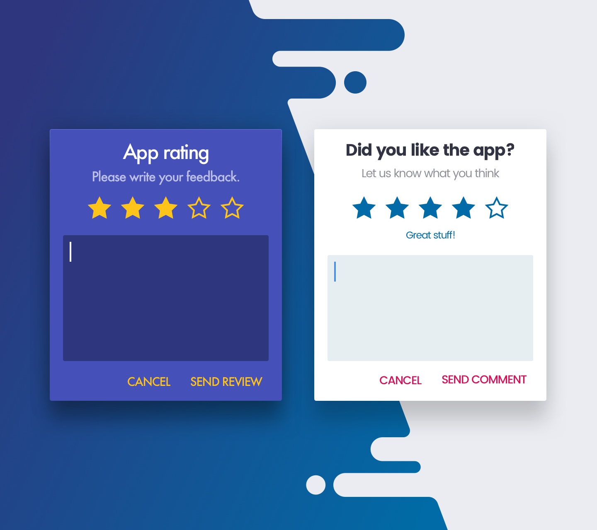
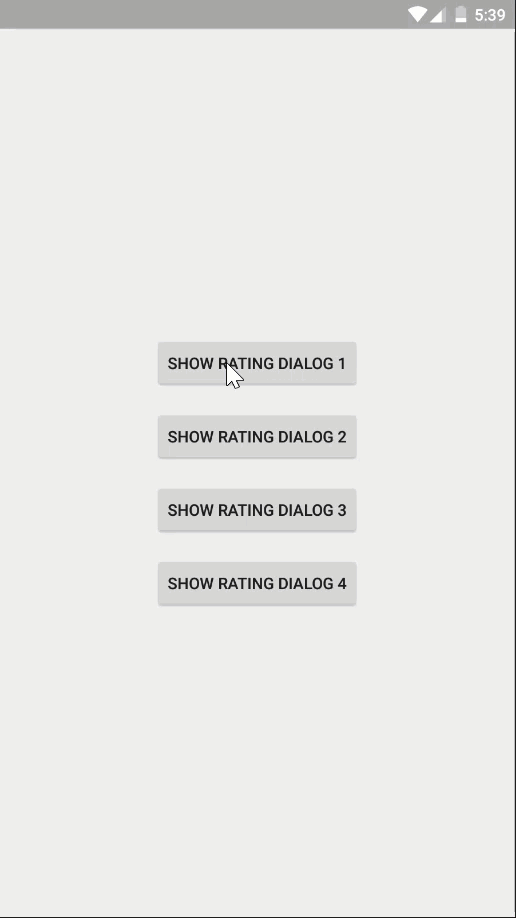
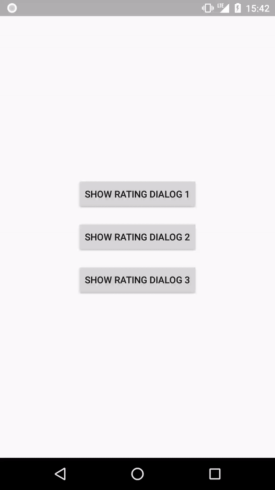

# Android App Rating 
[](https://jitpack.io/#hosseiniSeyRo/android-app-rating) 
[](https://android-arsenal.com/api?level=14)
[](https://github.com/vipulasri/Timeline-View/blob/master/LICENSE)


This library is actually a combination of three other libraries. And contains the benefits of all three of them.
  1. [stepstone-tech/android-material-app-rating](https://github.com/stepstone-tech/android-material-app-rating)
    - This library allows to use customized Rating Dialog inside applications.
  2. [hotchemi/Android-Rate](https://github.com/hotchemi/Android-Rate)
    - Android-Rate is a library to help you promote your android app by prompting users to rate the app after using it for a few days.
  3. [codemybrainsout/smart-app-rate](https://github.com/codemybrainsout/smart-app-rate)
    - Smart app rate dialog for Android which takes user rating into consideration. If the user rates the app below the defined threshold rating, the dialog will change into a feedback form. Otherwise, It will take the user to the Google PlayStore.
  
  





## Features
  - custom rating scope (number of stars)
  - set threshold for send feedback
  - show comment edit box if the user rates below the threshold
  - separate methods for below the threshold and more than
  - note descriptions below rating bar, which describes each note
  - defining custom dialog's title, description and hint
  - defining text for positive, negative and neutral button
  - enter/exit window animation
  - customizable colors
  - custom styles for dialog's background, stars, title, description, hint
  - auto show rate dialog by conditions:
    - app is launched more than 1 days later than installation. Change via setAfterInstallDay(int).
    - app is launched more than 8 times. Change via setNumberOfLaunches(int).
    - app is launched more than 2 days after neutral button clicked. Change via setRemindInterval(int).


## Demo
&nbsp;&nbsp;&nbsp;&nbsp;



## Installation

### Gradle

Step 1. Add it in your root build.gradle at the end of repositories:
```groovy
    allprojects {
		repositories {
			...
			maven { url 'https://jitpack.io' }
		}
	}
```
Step 2. Add it as a dependency in your app's build.gradle file
```groovy
    dependencies {
	        implementation 'com.github.hosseiniSeyRo:android-app-rating:1.1.0'
	}
```


## How to use

### Browse samples

There are few samples of rating dialog usage.
Please refer to `SamplesActivity` in `samples` module.


### Show dialog by event

This code need to be invoked inside FragmentActivity.
<b>Activity MUST implement RatingDialogListener !</b> Otherwise an exception will be thrown.
 
```java
private void showDialog() {
        new AppRatingDialog.Builder()
                .setPositiveButtonText("Submit")
                .setNegativeButtonText("Cancel")
                .setNeutralButtonText("Later")
                .setNoteDescriptions(Arrays.asList("Very Bad", "Not good", "Quite ok", "Very Good", "Excellent !!!"))
                .setDefaultRating(2)
                .setThreshold(3)
                .setTitle("Rate this application")
                .setDescription("Please select some stars and give your feedback")
                .setCommentInputEnabled(true)
                .setDefaultComment("This app is pretty cool !")
                .setStarColor(R.color.starColor)
                .setNoteDescriptionTextColor(R.color.noteDescriptionTextColor)
                .setTitleTextColor(R.color.titleTextColor)
                .setDescriptionTextColor(R.color.contentTextColor)
                .setHint("Please write your comment here ...")
                .setHintTextColor(R.color.hintTextColor)
                .setCommentTextColor(R.color.commentTextColor)
                .setCommentBackgroundColor(R.color.colorPrimaryDark)
                .setDialogBackgroundColor(R.color.rateAppDialogBackgroundColor)
                .setWindowAnimation(R.style.MyDialogFadeAnimation)
                .setCancelable(false)
                .setCanceledOnTouchOutside(false)
                .create(MainActivity.this)
                .setTargetFragment(this, TAG) // only if listener is implemented by fragment
                .show();
    }
```

### Getting results

Rating and comments can be fetched by listener implemented by activity.

```java
class MyActivity implements RatingDialogListener {

        @Override
        public void onPositiveButtonClickedWithComment(int rate, String comment) {
            // interpret results and comment, send it to analytics etc...
        }
    
        @Override
        public void onPositiveButtonClickedWithoutComment(int rate) {
            // interpret results, send it to analytics etc...
        }

        @Override
        public void onNegativeButtonClicked() {

        }
        
        @Override
        public void onNeutralButtonClicked() {

        }
}
```

### Configuration auto show rating dialog

Android-app-rating provides methods to configure its behavior.

```java
@Override
protected void onCreate(Bundle savedInstanceState) {
  super.onCreate(savedInstanceState);
  setContentView(R.layout.activity_main);

  buildRatingDialog().monitor();
  buildRatingDialog().showRateDialogIfMeetsConditions();
}

private AppRatingDialog buildRatingDialog() {
    return new AppRatingDialog.Builder()
            .setPositiveButtonText("Submit")
            .setNegativeButtonText("Cancel")
            .setNeutralButtonText("Later")
            .setNoteDescriptions(Arrays.asList("Very Bad", "Not good", "Quite ok", "Very Good", "Excellent !!!"))
            .setDefaultRating(2)
            .setThreshold(4)
            .setAfterInstallDay(0)
            .setNumberOfLaunches(3)
            .setRemindInterval(2)
            .setTitle("Rate this application")
            .setDescription("Please select some stars and give your feedback")
            .setStarColor(R.color.starColor)
            .setNoteDescriptionTextColor(R.color.noteDescriptionTextColor)
            .setTitleTextColor(R.color.titleTextColor)
            .setDescriptionTextColor(R.color.descriptionTextColor)
            .setCommentTextColor(R.color.commentTextColor)
            .setCommentBackgroundColor(R.color.colorPrimaryDark)
            .setDialogBackgroundColor(R.color.rateAppDialogBackgroundColor)
            .setWindowAnimation(R.style.MyDialogSlideHorizontalAnimation)
            .setHint("Please write your comment here ...")
            .setHintTextColor(R.color.hintTextColor)
            .setCancelable(false)
            .setCanceledOnTouchOutside(false)
            .create(this);
}
```

    
## Changelog
See [changelog](CHANGELOG.md)

## License
Copyright 2020 HosseiniSeyRo

Licensed under the Apache License, Version 2.0 (the "License");
you may not use this file except in compliance with the License.
You may obtain a copy of the License at

&nbsp;&nbsp;&nbsp;&nbsp;[http://www.apache.org/licenses/LICENSE-2.0](http://www.apache.org/licenses/LICENSE-2.0)

Unless required by applicable law or agreed to in writing, software
distributed under the License is distributed on an "AS IS" BASIS,
WITHOUT WARRANTIES OR CONDITIONS OF ANY KIND, either express or implied.
See the License for the specific language governing permissions and
limitations under the License.
